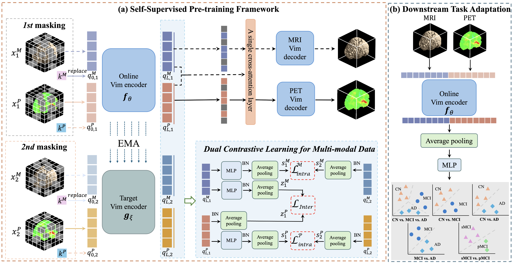

<div align="center">
<h1>ADFound </h1>
<h3>ADFound: A Foundation Model for Diagnosis and Prognosis of Alzheimer's Disease</h3>

</div>
Official implementation of "ADFound: A Foundation Model for Diagnosis and Prognosis of Alzheimer's Disease" (IEEE JBHI).

## Abstract
Alzheimer's disease (AD) is an incurable neurodegenerative disorder characterized by progressive cognitive and functional decline. Consequently, early diagnosis and accurate prediction of disease progression are of paramount importance and inherently complex, necessitating the integration of multi-modal data. However, most existing methods are task-specific models that lack generalization ability, addressing only one task at a time and failing to simultaneously assess disease diagnosis and progression. In this paper, we introduce ADFound, the first foundation model for AD that serves as a basis for various downstream tasks, such as diagnosis and prognosis, with high generalization capability. ADFound leverages a substantial amount of unlabeled 3D multi-modal neuroimaging, including paired and unpaired data, to achieve its objectives. Specifically, ADFound is developed upon the Multi-modal Vim encoder by Vision Mamba block to capture long-range dependencies inherent in 3D multi-modal medical images. To efficiently pre-train ADFound on unlabeled paired and upaired multi-modal neuroimaging data, we proposed a novel self-supervised learning framework that integrates multi-modal masked autoencoder (MAE) and contrastive learning. The multi-modal MAE aims to learn local relations among modalities by reconstructing images with unmasked image patches. Additionally, we introduce a Dual Contrastive Learning for Multi-modal Data to enhance the discriminative capabilities of multi-modal representations from intra-modal and inter-modal perspectives. Our experiments demonstrate that ADFound outperforms state-of-the-art methods across a wide range of downstream tasks relevant to the diagnosis and prognosis of AD. Furthermore, the results indicate that our foundation model can be extended to more modalities, such as non-image data, showing its versatility.


## Requirements
- Python 3.10.16
- PyTorch 2.1.1 + cu118
- torchvision 0.16.1+cu118
- numpy 1.26.2
- pandas 2.2.3
- mamba-ssm 1.1.1

## Installation

To install mamba-ssm, please refer to [Vim](https://github.com/hustvl/Vim), which must be installed with cuda 11.8.

## Pretrain


Our pretraining stragy can be divided into two stages:

- The first pre-training stage: The ADFound is pre-trained under the supervision of reconstruction loss for MRI $L_{rec}^{M}$ and PET reconstruction $L_{rec}^{P}$ and intra-modal contrastive loss for MRI $ L_{intra}^{M}$ and PET $L_{intra}^{P}$.

- The second pre-training stage: The inter-modal contrastive loss $L_{inter}$ was combined into training loss at the first stage with a constant weight $\lambda$.


## Citation
If you find Vim is useful in your research or applications, please consider giving us a star 🌟 and citing it by the following BibTeX entry.

```bibtex
@article{yang2025adfound,
  title={ADFound: A Foundation Model for Diagnosis and Prognosis of Alzheimer's Disease},
  author={Yang, Guangqian and Du, Kangrui and Yang, Zhihan and Du, Ye and Cheung, Eva Yi Wah and Zheng, Yongping and Yang, Mo and Kourtzi, Zoe and Schonlieb, Carola-Bibiane and Wang, Shujun},
  journal={IEEE journal of biomedical and health informatics},
  year={2025},
  publisher={IEEE}
}
```
